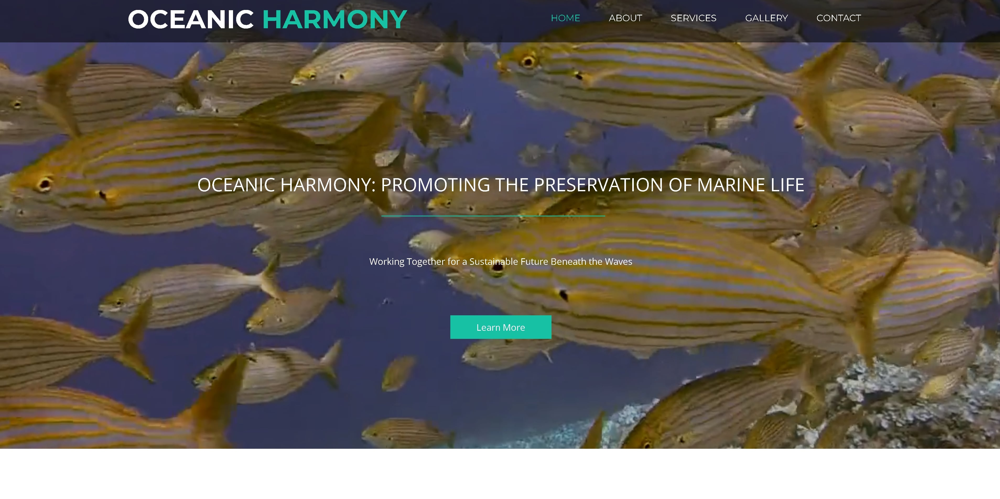

# Oceanic Harmony

Oceanic Harmony is a web application dedicated to marine conservation. It provides resources and tools for individuals to learn about marine ecosystems, participate in conservation efforts, and contribute to the protection of our oceans.

## Technologies Used

- HTML
- CSS
- JavaScript
- Bootstrap

You can view the project live [here](https://ambitious-forest-06d46d110.4.azurestaticapps.net/) deployed through Azure services.
